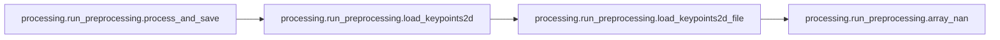
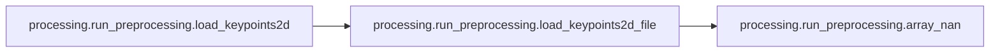
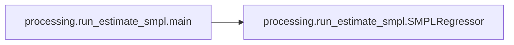
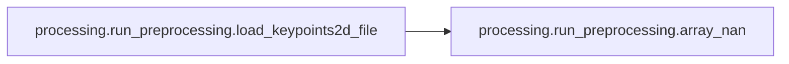
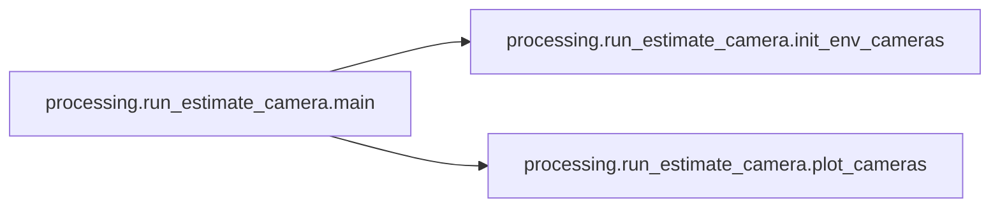

# Key Objects

[_Documentation generated by Documatic_](https://www.documatic.com)

<!---Documatic-section-processing.run_estimate_camera.plot_cameras-start--->
## processing.run_estimate_camera.plot_cameras

<!---Documatic-section-plot_cameras-start--->
<!---Documatic-block-processing.run_estimate_camera.plot_cameras-start--->
<details>
	<summary><code>processing.run_estimate_camera.plot_cameras</code> code snippet</summary>

```python
def plot_cameras(cgroup):
    points_world = np.array([[40.0, 0.0, 0.0], [0.0, 40.0, 0.0], [0.0, 0.0, 40.0]])
    colors = ['r', 'g', 'b']
    axes_all = [vedo.Arrows([[0, 0, 0]], [points_world[i]]).c(colors[i]) for i in range(3)]
    for camera in cgroup.cameras:
        rot_mat = cv2.Rodrigues(camera.rvec)[0]
        cam_center = -np.linalg.inv(rot_mat).dot(camera.tvec)
        points_cam = np.einsum('ij,kj->ki', np.linalg.inv(rot_mat), points_world)
        axes_all += [vedo.Arrows([cam_center], [cam_center + points_cam[i]]).c(colors[i]) for i in range(3)]
        axes_all += [vedo.Text(camera.name, cam_center, s=10)]
    return axes_all
```
</details>
<!---Documatic-block-processing.run_estimate_camera.plot_cameras-end--->
<!---Documatic-section-plot_cameras-end--->

# #
<!---Documatic-section-processing.run_estimate_camera.plot_cameras-end--->

<!---Documatic-section-processing.run_preprocessing.process_and_save-start--->
## processing.run_preprocessing.process_and_save

<!---Documatic-section-process_and_save-start--->


### Object Calls

* processing.run_preprocessing.load_keypoints2d

<!---Documatic-block-processing.run_preprocessing.process_and_save-start--->
<details>
	<summary><code>processing.run_preprocessing.process_and_save</code> code snippet</summary>

```python
def process_and_save(seq_name):
    (keypoints2d, det_scores, timestamps) = load_keypoints2d(FLAGS.keypoints_dir, seq_name=seq_name)
    os.makedirs(FLAGS.save_dir, exist_ok=True)
    save_path = os.path.join(FLAGS.save_dir, f'{seq_name}.pkl')
    with open(save_path, 'wb') as f:
        pickle.dump({'keypoints2d': keypoints2d, 'det_scores': det_scores, 'timestamps': timestamps}, f, protocol=pickle.HIGHEST_PROTOCOL)
```
</details>
<!---Documatic-block-processing.run_preprocessing.process_and_save-end--->
<!---Documatic-section-process_and_save-end--->

# #
<!---Documatic-section-processing.run_preprocessing.process_and_save-end--->

<!---Documatic-section-processing.run_preprocessing.load_keypoints2d-start--->
## processing.run_preprocessing.load_keypoints2d

<!---Documatic-section-load_keypoints2d-start--->


### Object Calls

* processing.run_preprocessing.load_keypoints2d_file

<!---Documatic-block-processing.run_preprocessing.load_keypoints2d-start--->
<details>
	<summary><code>processing.run_preprocessing.load_keypoints2d</code> code snippet</summary>

```python
def load_keypoints2d(data_dir, seq_name):
    video_names = [AISTDataset.get_video_name(seq_name, view) for view in AISTDataset.VIEWS]
    paths_cache = {}
    timestamps = []
    for video_name in video_names:
        paths = sorted(glob.glob(os.path.join(data_dir, video_name, '*.json')))
        paths_cache[video_name] = paths
        if FLAGS.data_type == 'internal':
            timestamps += [int(os.path.basename(p).split('.')[0].split('_')[-1]) for p in paths]
        elif FLAGS.data_type == 'openpose':
            timestamps += [int(os.path.basename(p).split('.')[0].split('_')[0]) for p in paths]
        else:
            raise ValueError(FLAGS.data_type)
    timestamps = np.array(sorted(list(set(timestamps))))
    keypoints2d = []
    det_scores = []
    for video_name in video_names:
        if FLAGS.data_type == 'internal':
            paths = [os.path.join(data_dir, video_name, f'{video_name}_{ts}.json') for ts in timestamps]
        elif FLAGS.data_type == 'openpose':
            paths = [os.path.join(data_dir, video_name, f'{ts:08d}_keypoints.json') for ts in timestamps]
        else:
            raise ValueError(FLAGS.data_type)
        keypoints2d_per_view = []
        det_scores_per_view = []
        for path in paths:
            (keypoint, det_score) = load_keypoints2d_file(path)
            keypoints2d_per_view.append(keypoint)
            det_scores_per_view.append(det_score)
        keypoints2d.append(keypoints2d_per_view)
        det_scores.append(det_scores_per_view)
    keypoints2d = np.array(keypoints2d, dtype=np.float32)
    det_scores = np.array(det_scores, dtype=np.float32)
    return (keypoints2d, det_scores, timestamps)
```
</details>
<!---Documatic-block-processing.run_preprocessing.load_keypoints2d-end--->
<!---Documatic-section-load_keypoints2d-end--->

# #
<!---Documatic-section-processing.run_preprocessing.load_keypoints2d-end--->

<!---Documatic-section-processing.run_estimate_smpl.main-start--->
## processing.run_estimate_smpl.main

<!---Documatic-section-main-start--->


### Object Calls

* processing.run_estimate_smpl.SMPLRegressor

<!---Documatic-block-processing.run_estimate_smpl.main-start--->
<details>
	<summary><code>processing.run_estimate_smpl.main</code> code snippet</summary>

```python
def main(_):
    if FLAGS.visualize:
        assert SUPPORT_VIS, '--visualize is not support! Fail to import vedo or trimesh.'
    aist_dataset = AISTDataset(FLAGS.anno_dir)
    smpl_regressor = SMPLRegressor(FLAGS.smpl_dir, 'MALE')
    if FLAGS.sequence_names:
        seq_names = FLAGS.sequence_names
    else:
        seq_names = aist_dataset.mapping_seq2env.keys()
    for seq_name in seq_names:
        logging.info('processing %s', seq_name)
        keypoints3d = AISTDataset.load_keypoint3d(aist_dataset.keypoint3d_dir, seq_name, use_optim=True)
        if FLAGS.data_type == 'internal':
            (smpl, loss) = smpl_regressor.fit(keypoints3d, dtype='coco', verbose=True)
        elif FLAGS.data_type == 'openpose':
            (smpl, loss) = smpl_regressor.fit(keypoints3d, dtype='openpose25', verbose=True)
        else:
            raise ValueError(FLAGS.data_type)
        with torch.no_grad():
            _ = smpl.forward()
        body_pose = smpl.body_pose.detach().cpu().numpy()
        global_orient = smpl.global_orient.detach().cpu().numpy()
        smpl_poses = np.concatenate([global_orient, body_pose], axis=1)
        smpl_scaling = smpl.scaling.detach().cpu().numpy()
        smpl_trans = smpl.transl.detach().cpu().numpy()
        os.makedirs(FLAGS.save_dir, exist_ok=True)
        motion_file = os.path.join(FLAGS.save_dir, f'{seq_name}.pkl')
        with open(motion_file, 'wb') as f:
            pickle.dump({'smpl_poses': smpl_poses, 'smpl_scaling': smpl_scaling, 'smpl_trans': smpl_trans, 'smpl_loss': loss}, f, protocol=pickle.HIGHEST_PROTOCOL)
```
</details>
<!---Documatic-block-processing.run_estimate_smpl.main-end--->
<!---Documatic-section-main-end--->

# #
<!---Documatic-section-processing.run_estimate_smpl.main-end--->

<!---Documatic-section-processing.run_openpose.main-start--->
## processing.run_openpose.main

<!---Documatic-section-main-start--->
<!---Documatic-block-processing.run_openpose.main-start--->
<details>
	<summary><code>processing.run_openpose.main</code> code snippet</summary>

```python
def main(_):
    os.makedirs(FLAGS.image_save_dir, exist_ok=True)
    os.makedirs(FLAGS.openpose_save_dir, exist_ok=True)
    if FLAGS.sequence_names:
        seq_names = FLAGS.sequence_names
    else:
        aist_dataset = AISTDataset(FLAGS.anno_dir)
        seq_names = aist_dataset.mapping_seq2env.keys()
    for seq_name in seq_names:
        for view in AISTDataset.VIEWS:
            video_name = AISTDataset.get_video_name(seq_name, view)
            video_file = os.path.join(FLAGS.video_dir, video_name + '.mp4')
            if not os.path.exists(video_file):
                continue
            logging.info('processing %s', video_file)
            image_dir = os.path.join(FLAGS.image_save_dir, video_name)
            ffmpeg_video_to_images(video_file, image_dir, fps=60)
            save_dir = os.path.join(FLAGS.openpose_save_dir, video_name)
            os.system('cd %s; ' % FLAGS.openpose_dir + './build/examples/openpose/openpose.bin ' + '--image_dir %s ' % image_dir + '--write_json %s ' % save_dir + '--display 0 --hand --face --render_pose 0')
```
</details>
<!---Documatic-block-processing.run_openpose.main-end--->
<!---Documatic-section-main-end--->

# #
<!---Documatic-section-processing.run_openpose.main-end--->

<!---Documatic-section-processing.run_preprocessing.array_nan-start--->
## processing.run_preprocessing.array_nan

<!---Documatic-section-array_nan-start--->
<!---Documatic-block-processing.run_preprocessing.array_nan-start--->
<details>
	<summary><code>processing.run_preprocessing.array_nan</code> code snippet</summary>

```python
def array_nan(shape, dtype=np.float32):
    array = np.empty(shape, dtype=dtype)
    array[:] = np.nan
    return array
```
</details>
<!---Documatic-block-processing.run_preprocessing.array_nan-end--->
<!---Documatic-section-array_nan-end--->

# #
<!---Documatic-section-processing.run_preprocessing.array_nan-end--->

<!---Documatic-section-processing.run_estimate_keypoints.main-start--->
## processing.run_estimate_keypoints.main

<!---Documatic-section-main-start--->
<!---Documatic-block-processing.run_estimate_keypoints.main-start--->
<details>
	<summary><code>processing.run_estimate_keypoints.main</code> code snippet</summary>

```python
def main(_):
    aist_dataset = AISTDataset(anno_dir=FLAGS.anno_dir)
    if FLAGS.sequence_names:
        seq_names = FLAGS.sequence_names
    else:
        seq_names = aist_dataset.mapping_seq2env.keys()
    for seq_name in seq_names:
        logging.info('processing %s', seq_name)
        env_name = aist_dataset.mapping_seq2env[seq_name]
        cgroup = AISTDataset.load_camera_group(aist_dataset.camera_dir, env_name)
        (keypoints2d, det_scores, _) = AISTDataset.load_keypoint2d(aist_dataset.keypoint2d_dir, seq_name=seq_name)
        (nviews, nframes, _, _) = keypoints2d.shape
        assert det_scores.shape[0] == nviews
        assert det_scores.shape[1] == nframes
        if seq_name == 'gBR_sBM_cAll_d04_mBR0_ch01':
            keypoints2d[4] = np.nan
        if seq_name == 'gJB_sBM_cAll_d07_mJB3_ch05':
            keypoints2d[6] = np.nan
        kpt_thre = 0.15
        ignore_idxs = np.where(keypoints2d[:, :, :, 2] < kpt_thre)
        keypoints2d[ignore_idxs[0], ignore_idxs[1], ignore_idxs[2], :] = np.nan
        det_thre = 0.0
        ignore_idxs = np.where(det_scores < det_thre)
        keypoints2d[ignore_idxs[0], ignore_idxs[1], :, :] = np.nan
        keypoints2d = keypoints2d[:, :, :, 0:2]
        if FLAGS.data_type == 'internal':
            bones = [(5, 7), (7, 9), (6, 8), (8, 10), (11, 13), (13, 15), (12, 14), (14, 16), (0, 1), (0, 2), (1, 2), (0, 3), (0, 4), (3, 4)]
        elif FLAGS.data_type == 'openpose':
            body_bones = np.array([(0, 15), (0, 16), (15, 17), (16, 18), (0, 1), (1, 2), (2, 3), (3, 4), (1, 5), (5, 6), (6, 7), (1, 8), (8, 9), (9, 10), (10, 11), (11, 24), (11, 22), (11, 23), (22, 23), (23, 24), (24, 22), (8, 12), (12, 13), (13, 14), (14, 21), (14, 19), (14, 20), (19, 20), (20, 21), (21, 19)])
            bones = body_bones.tolist()
        else:
            raise ValueError(FLAGS.data_type)
        keypoints3d = cgroup.triangulate(keypoints2d.reshape(nviews, -1, 2)).reshape(nframes, -1, 3)
        keypoints3d_optim = cgroup.triangulate_optim(keypoints2d, constraints=bones, verbose=True).reshape(nframes, -1, 3)
        os.makedirs(FLAGS.save_dir, exist_ok=True)
        keypoints_file = os.path.join(FLAGS.save_dir, f'{seq_name}.pkl')
        with open(keypoints_file, 'wb') as f:
            pickle.dump({'keypoints3d': keypoints3d, 'keypoints3d_optim': keypoints3d_optim}, f, protocol=pickle.HIGHEST_PROTOCOL)
```
</details>
<!---Documatic-block-processing.run_estimate_keypoints.main-end--->
<!---Documatic-section-main-end--->

# #
<!---Documatic-section-processing.run_estimate_keypoints.main-end--->

<!---Documatic-section-processing.run_preprocessing.load_keypoints2d_file-start--->
## processing.run_preprocessing.load_keypoints2d_file

<!---Documatic-section-load_keypoints2d_file-start--->


### Object Calls

* processing.run_preprocessing.array_nan

<!---Documatic-block-processing.run_preprocessing.load_keypoints2d_file-start--->
<details>
	<summary><code>processing.run_preprocessing.load_keypoints2d_file</code> code snippet</summary>

```python
def load_keypoints2d_file(file_path):
    if FLAGS.data_type == 'internal':
        njoints = 17
    elif FLAGS.data_type == 'openpose':
        njoints = 25
    else:
        raise ValueError(FLAGS.data_type)
    keypoint = array_nan((njoints, 3), dtype=np.float32)
    det_score = 0.0
    try:
        with open(file_path, 'r') as f:
            data = json.load(f)
    except Exception as e:
        logging.warning(e)
        return (keypoint, det_score)
    if FLAGS.data_type == 'internal':
        keypoints = np.array(data['keypoints']).reshape((-1, njoints, 3))
        det_scores = np.array(data['detection_scores'])
    elif FLAGS.data_type == 'openpose':
        keypoints = []
        for person in data['people']:
            for key in ['pose']:
                keypoints.extend(person['%s_keypoints_2d' % key])
        keypoints = np.array(keypoints).reshape(len(data['people']), -1, 3)
        assert keypoints.shape[1] == njoints, 'The shape is not right. %s v.s. %d'(str(keypoints.shape), njoints)
        det_scores = np.mean(keypoints[:, 0:25, -1], axis=-1)
    else:
        raise ValueError(FLAGS.data_type)
    if det_scores.shape[0] == 0:
        return (keypoint, det_score)
    else:
        idx = np.argmax(det_scores)
        keypoint = keypoints[idx]
        det_score = det_scores[idx]
        return (keypoint, det_score)
```
</details>
<!---Documatic-block-processing.run_preprocessing.load_keypoints2d_file-end--->
<!---Documatic-section-load_keypoints2d_file-end--->

# #
<!---Documatic-section-processing.run_preprocessing.load_keypoints2d_file-end--->

<!---Documatic-section-processing.run_preprocessing.main-start--->
## processing.run_preprocessing.main

<!---Documatic-section-main-start--->
<!---Documatic-block-processing.run_preprocessing.main-start--->
<details>
	<summary><code>processing.run_preprocessing.main</code> code snippet</summary>

```python
def main(_):
    if FLAGS.sequence_names:
        seq_names = FLAGS.sequence_names
    else:
        aist_dataset = AISTDataset(FLAGS.anno_dir)
        seq_names = aist_dataset.mapping_seq2env.keys()
    pool = multiprocessing.Pool(16)
    pool.map(process_and_save, seq_names)
```
</details>
<!---Documatic-block-processing.run_preprocessing.main-end--->
<!---Documatic-section-main-end--->

# #
<!---Documatic-section-processing.run_preprocessing.main-end--->

<!---Documatic-section-processing.run_segmentation.main-start--->
## processing.run_segmentation.main

<!---Documatic-section-main-start--->


### Object Calls

* processing.run_segmentation.estimate_background

<!---Documatic-block-processing.run_segmentation.main-start--->
<details>
	<summary><code>processing.run_segmentation.main</code> code snippet</summary>

```python
def main(_):
    model = torch.hub.load('PeterL1n/RobustVideoMatting', 'resnet50').cuda()
    converter = torch.hub.load('PeterL1n/RobustVideoMatting', 'converter')
    if not os.path.exists('/tmp/model.pth'):
        os.system('gdown https://drive.google.com/uc?id=1ErIAsB_miVhYL9GDlYUmfbqlV293mSYf -O /tmp/model.pth -q')
    if not os.path.exists('/tmp/BackgroundMattingV2'):
        os.system('cd /tmp/; git clone -q https://github.com/PeterL1n/BackgroundMattingV2')
    if FLAGS.sequence_names:
        seq_names = FLAGS.sequence_names
    else:
        aist_dataset = AISTDataset(FLAGS.anno_dir)
        seq_names = aist_dataset.mapping_seq2env.keys()
    os.makedirs(FLAGS.save_dir, exist_ok=True)
    for seq_name in seq_names:
        for view in AISTDataset.VIEWS:
            video_name = AISTDataset.get_video_name(seq_name, view)
            video_file = os.path.join(FLAGS.video_dir, video_name + '.mp4')
            if not os.path.exists(video_file):
                continue
            logging.info('processing %s', video_file)
            alpha_file = os.path.join(FLAGS.save_dir, video_name + '_alpha1.mp4')
            if not os.path.exists(alpha_file):
                converter(model, input_source=video_file, downsample_ratio=None, output_type='video', output_alpha=alpha_file, output_video_mbps=4, seq_chunk=12, num_workers=1, progress=True)
            background_file = os.path.join(FLAGS.save_dir, video_name + '_bg.png')
            if not os.path.exists(background_file):
                estimate_background(video_file, alpha_file, background_file)
            final_file = os.path.join(FLAGS.save_dir, video_name + '_alpha2')
            if not os.path.exists(final_file):
                os.system('cd /tmp/BackgroundMattingV2/; ' + 'python inference_video.py ' + '--model-type mattingrefine ' + '--model-backbone resnet50 ' + '--model-backbone-scale 0.25 ' + '--model-refine-mode sampling ' + '--model-refine-sample-pixels 80000 ' + "--model-checkpoint '/tmp/model.pth' " + "--video-src '%s' " % video_file + "--video-bgr '%s' " % background_file + "--output-dir '%s' " % final_file + '--output-type pha')
            if os.path.exists(final_file):
                os.system('mv %s/pha.mp4 %s.mp4; rm -rf %s' % (final_file, final_file, final_file))
```
</details>
<!---Documatic-block-processing.run_segmentation.main-end--->
<!---Documatic-section-main-end--->

# #
<!---Documatic-section-processing.run_segmentation.main-end--->

<!---Documatic-section-processing.run_estimate_camera.main-start--->
## processing.run_estimate_camera.main

<!---Documatic-section-main-start--->


### Object Calls

* processing.run_estimate_camera.init_env_cameras
* processing.run_estimate_camera.plot_cameras

<!---Documatic-block-processing.run_estimate_camera.main-start--->
<details>
	<summary><code>processing.run_estimate_camera.main</code> code snippet</summary>

```python
def main(_):
    aist_dataset = AISTDataset(anno_dir=FLAGS.anno_dir)
    for (env_name, seq_names) in aist_dataset.mapping_env2seq.items():
        cgroup = init_env_cameras()
        seq_names = random.choices(seq_names, k=20)
        keypoints2d_all = []
        for seq_name in seq_names:
            (keypoints2d_raw, _, _) = AISTDataset.load_keypoint2d(aist_dataset.keypoint2d_dir, seq_name=seq_name)
            if seq_name == 'gBR_sBM_cAll_d04_mBR0_ch01':
                keypoints2d_raw[4] = np.nan
            if seq_name == 'gJB_sBM_cAll_d07_mJB3_ch05':
                keypoints2d_raw[6] = np.nan
            keypoints2d_all.append(keypoints2d_raw)
        keypoints2d_all = np.concatenate(keypoints2d_all, axis=1)
        kpt_thre = 0.5
        ignore_idxs = np.where(keypoints2d_all[:, :, :, 2] < kpt_thre)
        keypoints2d_all[ignore_idxs[0], ignore_idxs[1], ignore_idxs[2], :] = np.nan
        keypoints2d_all = keypoints2d_all[..., 0:2]
        nviews = keypoints2d_all.shape[0]
        cgroup.bundle_adjust_iter(keypoints2d_all.reshape(nviews, -1, 2), n_iters=20, n_samp_iter=500, n_samp_full=5000, verbose=True)
        os.makedirs(FLAGS.save_dir, exist_ok=True)
        camera_file = os.path.join(FLAGS.save_dir, f'{env_name}.json')
        with open(camera_file, 'w') as f:
            json.dump([camera.get_dict() for camera in cgroup.cameras], f)
        if FLAGS.visualize:
            print('seq_name:', seq_name)
            axes_all = plot_cameras(cgroup)
            keypoints3d = cgroup.triangulate(keypoints2d_all[:, 0].reshape(nviews, -1, 2)).reshape(-1, 3)
            vedo.show(*axes_all, vedo.Points(keypoints3d, r=12), interactive=True, axes=True)
            vedo.clear()
```
</details>
<!---Documatic-block-processing.run_estimate_camera.main-end--->
<!---Documatic-section-main-end--->

# #
<!---Documatic-section-processing.run_estimate_camera.main-end--->

<!---Documatic-section-processing.run_estimate_camera.init_env_cameras-start--->
## processing.run_estimate_camera.init_env_cameras

<!---Documatic-section-init_env_cameras-start--->
<!---Documatic-block-processing.run_estimate_camera.init_env_cameras-start--->
<details>
	<summary><code>processing.run_estimate_camera.init_env_cameras</code> code snippet</summary>

```python
def init_env_cameras():
    cams = []
    for (i, view) in enumerate(AISTDataset.VIEWS):
        f = 1600
        cx = 1920 // 2
        cy = 1080 // 2
        if view == 'c09':
            r1 = R.from_euler('y', 180, degrees=True)
            r2 = R.from_euler('z', 180, degrees=True)
            rvec = (r1 * r2).as_rotvec()
            tvec = [0, 170, 500]
        else:
            r1 = R.from_euler('y', 180 - 360 // 8 * i, degrees=True)
            r2 = R.from_euler('z', 180, degrees=True)
            rvec = (r1 * r2).as_rotvec()
            tvec = [0, 180, 500]
        matrix = np.array([[f, 0, cx], [0, f, cy], [0, 0, 1]], dtype=np.float32)
        cams.append(aniposelib.cameras.Camera(matrix=matrix, rvec=rvec, tvec=tvec, name=view, size=(1920, 1080)))
    cgroup = aniposelib.cameras.CameraGroup(cams)
    return cgroup
```
</details>
<!---Documatic-block-processing.run_estimate_camera.init_env_cameras-end--->
<!---Documatic-section-init_env_cameras-end--->

# #
<!---Documatic-section-processing.run_estimate_camera.init_env_cameras-end--->

<!---Documatic-section-processing.run_segmentation.estimate_background-start--->
## processing.run_segmentation.estimate_background

<!---Documatic-section-estimate_background-start--->
<!---Documatic-block-processing.run_segmentation.estimate_background-start--->
<details>
	<summary><code>processing.run_segmentation.estimate_background</code> code snippet</summary>

```python
def estimate_background(input_video: str, alpha_video: str, output_image: str):
    video_reader = imageio.get_reader(input_video)
    alpha_reader = imageio.get_reader(alpha_video)
    (background, weights) = (0, 0)
    for (img, alpha) in tqdm.tqdm(zip(video_reader, alpha_reader)):
        weight = 1 - np.float32(alpha) / 255.0
        weights += weight
        background += np.float32(img) * weight
    background /= weights + 1e-08
    imageio.imwrite(output_image, np.uint8(background))
```
</details>
<!---Documatic-block-processing.run_segmentation.estimate_background-end--->
<!---Documatic-section-estimate_background-end--->

# #
<!---Documatic-section-processing.run_segmentation.estimate_background-end--->

[_Documentation generated by Documatic_](https://www.documatic.com)